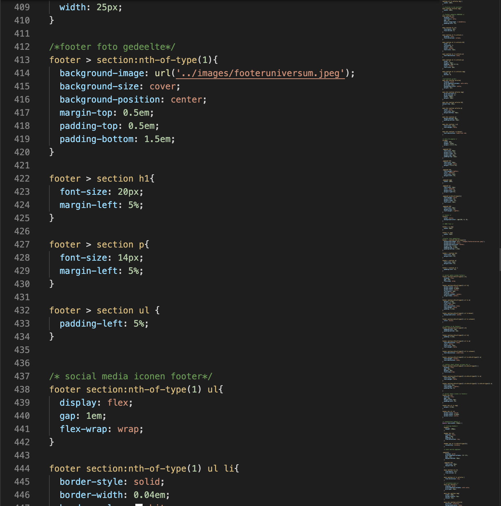
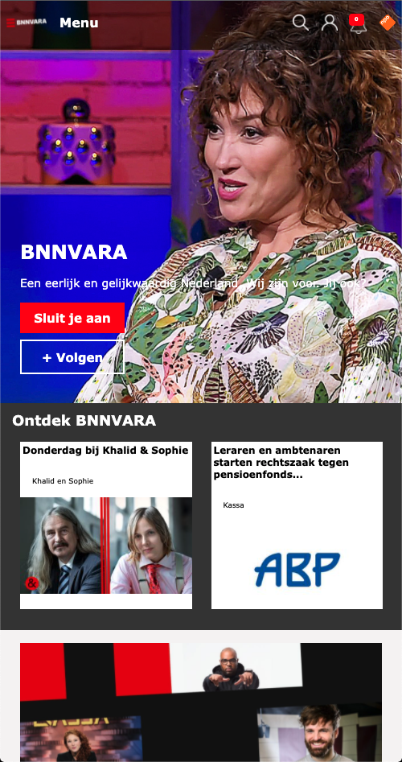
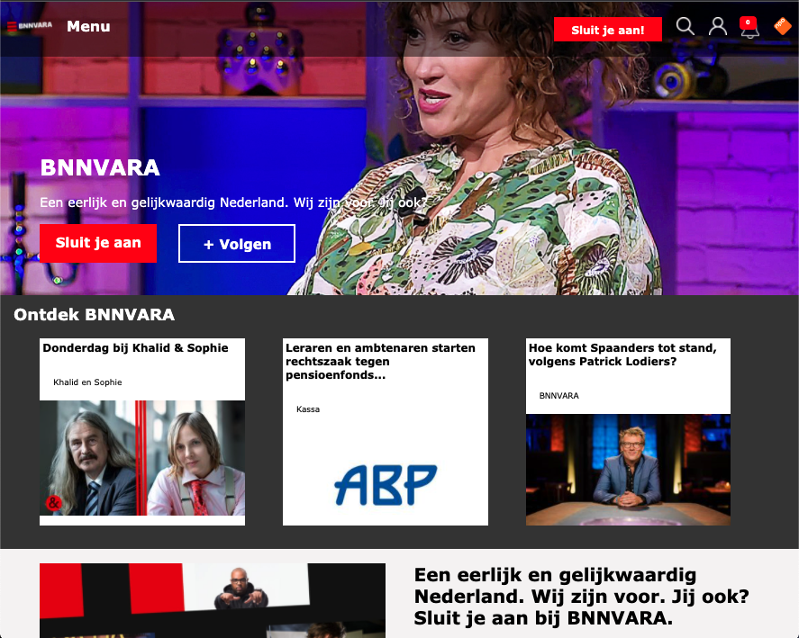

# Procesverslag
Markdown is een simpele manier om HTML te schrijven.  
Markdown cheat cheet: [Hulp bij het schrijven van Markdown](https://github.com/adam-p/markdown-here/wiki/Markdown-Cheatsheet).

Nb. De standaardstructuur en de spartaanse opmaak van de README.md zijn helemaal prima. Het gaat om de inhoud van je procesverslag. Besteedt de tijd voor pracht en praal aan je website.

Nb. Door *open* toe te voegen aan een *details* element kun je deze standaard open zetten. Fijn om dat steeds voor de relevante stuk(ken) te doen.

## Jij

uitwerken voor kick-off werkgroep

### Auteur:
Emma Landewe

#### Je startniveau:
Blauw

#### Je focus:
Responsive
 

## Je website

uitwerken voor kick-off werkgroep

### Je opdracht:
https://www.bnnvara.nl/

#### Screenshot(s) van de eerste pagina (small screen): 
homepage

#### Screenshot(s) van de tweede pagina (small screen):
Informatiepagina

 

## Voortgang 1 (week 2)

uitwerken voor 1e voortgang

### Stand van zaken
Wat ging er goed: correct semantische HTML schrijven. 
wat ging er niet goed: de elementen aanroepen in de CSS.

Screenshots HTML pagina:

### Verslag van meeting
hier na afloop snel de uitkomsten van de meeting vastleggen

- Zorg dat je CSS er netjes uit ziet zodat je makkelijk dingen terug kan vinden.
- Begin met het maken van flexbox en daarna pas de styling
- Nog veel werk te doen. 

## Voortgang 2 (week 3)

uitwerken voor 2e voortgang

### Stand van zaken
Ik heb grote stappen gemaakt op het gebied van CSS. alles staat netter geordend en is overzichtelijker. 
Ik ben begonnen met het implementeren van Flexbox en dat is goed gelukt. De site begint steeds meer op de echte site te lijken. 

### vragen voor tijdens de voortgang: 
- omdat ik position absolute heb gedaan wil de header niet meer sticky blijven? 
- moeten de opdrachten ook in de bronnenlijst
- .bodymargin -> mag dit? (Omdat we margin mee wouden geven aan de body, maar er stond nog een element in die geen margin moest hebben. En dat moet je al je verwijzingen aanpassen). 

### voortgang in foto's
 mediaquery's zijn toegevoegd aan de CSS. Dit maakt de site meer responsive. 

 de microinteractie is aan de site toegevoegd. 

### Verslag van meeting
hier na afloop snel de uitkomsten van de meeting vastleggen

- Erg goed op weg laatste dingen nog aanvullen en responsive maken
- microinteractie is te simpel, kijk of je iets kunt doen wat meer past bij de site
- CSS is gestructureerder vormgegeven. 

## Eindgesprek (week 5)

uitwerken voor eindgesprek

### Stand van zaken
Aan het begin vond ik de lessen wat te snel gaan. Ik moest me helemaal opnieuw verdiepen in de stof en dat kostte me veel tijd. Toen ik eenmaal aan de slag ging merkte ik dat ik dingen begon te begrijpen. 

In het proces heb ik achteraf wel een aantal foutjes gemaakt. Mijn HTML had weinig lijsten waardoor het responsive maken van de site moeilijker ging. Ik heb achteraf nog veel tijd moeten besteden aan veel dingen zetten in een UL. 

Mijn CSS was een rommeltje. CSS is iets wat ik vanaf het begin lastig vond. Ik vond het moeilijk om elementen aan te roepen en daardoor werd mijn CSS lang en onoverzichtelijk. Het niet gebruiken van classes maakte het allemaal nog niet iets ingewikkelder. Ik heb een avond besteed aan het overzichtelijk maken hiervan en dat gaf me een stuk meer overzicht. 

Nog steeds is mijn CSS lang, maar door de comments heb ik meer overzicht. 

Ik heb een lange tijd aangeklooid met mijn micro-interactie. Om te beginnen met het bedenken van een micro-interactie. Ik begon met een microinteractie om het thema te veranderen. Na een voortgangsgesprek kwamen we tot de conclusie dat dat wellicht wat te simpel was en ben ik gegaan voor het opslaan van een artikel. Ik had achteraf wat meer willen spelen met Javascript maar had, hard gezegd, de tijd er niet voor. Daarom heb ik me vooral gericht op het responsive maken en een nette HTML en vormgeving. 

Ik ben erg tevreden over het eindresultaat (als je dat mag zeggen?). Ik heb veel geleerd en had mezelf voorgenomen bij elke les aanwezig te zijn. Ik heb voortgangen laten zien en heb meer kennis opgedaan. 

### Screenshot(s)

hier screenshot(s) van je eindresultaat: de code
 HTML code -> semantisch
 HTML code -> semantisch
 CSS code -> flexbox
 CSS code -> mediaquery
 De microinteractie in javascript

eindresultaat:
 screenshot phone formaat
 screenshot phone formaat
 screenshot tablet formaat
 screenshot tablet formaat
 screenshot tablet formaat
 screenshot desktop formaat
 screenshot desktop formaat
 screenshot desktop formaat

## Bronnenlijst

continu bijhouden terwijl je werkt

Nb. Wees specifiek ('css-tricks' als bron is bijv. niet specifiek genoeg).

1. https://www.w3schools.com/cssref/pr_list-style-type.asp 
2. https://gathering.tweakers.net/forum/list_messages/348586 
3. https://www.w3schools.com/cssref/pr_class_position.asp
4. https://css-tricks.com/snippets/css/a-guide-to-flexbox/ 
5. https://css-tricks.com/position-sticky-2/ 
6. https://www.designcise.com/web/tutorial/how-to-fix-issues-with-css-position-sticky-not-working 
7. https://cssreference.io/property/flex-direction/ 
8. https://www.w3schools.com/cssref/pr_border-style.asp 
9. https://developer.mozilla.org/en-US/docs/Web/CSS/CSS_Flexible_Box_Layout/Ordering_Flex_Items 
10. https://www.collinsdictionary.com/dictionary/english/fr#:~:text=1.,abbreviation%20for%20French%20or%20%2C%20franc.&text=Fr%20is%20a%20written%20abbreviation%20for%20father%20when%20it%20is,name%20of%20a%20Catholic%20priest. 
11. https://css-tricks.com/snippets/css/complete-guide-grid/ 

