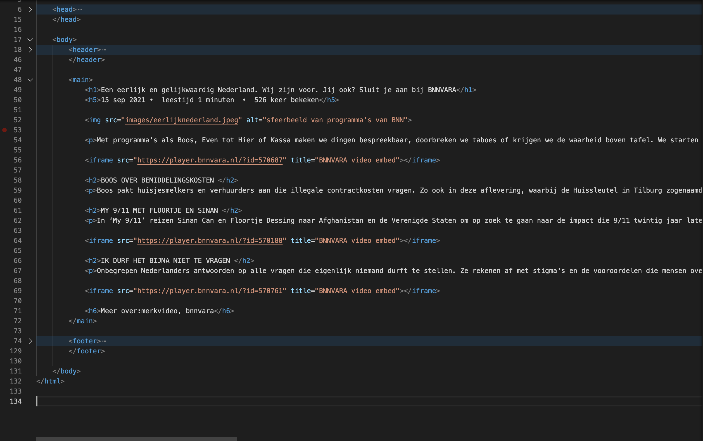

# Procesverslag
Markdown is een simpele manier om HTML te schrijven.  
Markdown cheat cheet: [Hulp bij het schrijven van Markdown](https://github.com/adam-p/markdown-here/wiki/Markdown-Cheatsheet).

Nb. De standaardstructuur en de spartaanse opmaak van de README.md zijn helemaal prima. Het gaat om de inhoud van je procesverslag. Besteedt de tijd voor pracht en praal aan je website.

Nb. Door *open* toe te voegen aan een *details* element kun je deze standaard open zetten. Fijn om dat steeds voor de relevante stuk(ken) te doen.

## Jij

uitwerken voor kick-off werkgroep

### Auteur:
Emma Landewe

#### Je startniveau:
Blauw

#### Je focus:
Responsive
 

## Je website

uitwerken voor kick-off werkgroep

### Je opdracht:
https://www.bnnvara.nl/

#### Screenshot(s) van de eerste pagina (small screen): 
homepage

#### Screenshot(s) van de tweede pagina (small screen):
Informatiepagina

 

## Breakdownschets (week 1)

uitwerken na afloop 2e werkgroep

### de hele pagina: 

### dynamisch deel (bijv menu): 

### wellicht nog een dynamisch deel (bijv filter): 

## Voortgang 1 (week 2)

uitwerken voor 1e voortgang

### Stand van zaken
Wat ging er goed: correct semantische HTML schrijven. 
wat ging er niet goed: de elementen aanroepen in de CSS.

Screenshots HTML pagina:

### Verslag van meeting
hier na afloop snel de uitkomsten van de meeting vastleggen

- Zorg dat je CSS er netjes uit ziet zodat je makkelijk dingen terug kan vinden.
- Begin met het maken van flexbox en daarna pas de styling
- Nog veel werk te doen. 

## Voortgang 2 (week 3)

uitwerken voor 2e voortgang

### Stand van zaken
Ik heb grote stappen gemaakt op het gebied van CSS. alles staat netter geordend en is overzichtelijker. 
Ik ben begonnen met het implementeren van Flexbox en dat is goed gelukt. De site begint steeds meer op de echte site te lijken. 

### vragen voor tijdens de voortgang: 
- omdat ik position absolute heb gedaan wil de header niet meer sticky blijven? 
- moeten de opdrachten ook in de bronnenlijst
- .bodymargin -> mag dit? (Omdat we margin mee wouden geven aan de body, maar er stond nog een element in die geen margin moest hebben. En dat moet je al je verwijzingen aanpassen). 

### voortgang in foto's
 mediaquery's zijn toegevoegd aan de CSS. Dit maakt de site meer responsive. 

 de microinteractie is aan de site toegevoegd. 

### Verslag van meeting
hier na afloop snel de uitkomsten van de meeting vastleggen

- punt 1
- punt 2
- nog een punt
- ...

## Toegankelijkheidstest (week 4)

uitwerken na test in 8e voortgang

### Bevindingen
Lijst met je bevindingen die in de test naar voren kwamen:
- Niet alles is klikbaar wat klikbaar moet zijn. 

#### Titel eerste bevinding
Hier korte omschrijving (met indien nodig een afbeelding)

Hier een omschrijving van hoe het opgelost kan worden (met indien nodig een afbeelding)

#### Titel tweede bevinding. 
Hier korte omschrijving (met indien nodig een afbeelding)
Hier een omschrijving van hoe het opgelost kan worden (met indien nodig een afbeelding)

#### Titel volgende bevinding. 
Hier korte omschrijving (met indien nodig een afbeelding)

Hier een omschrijving van hoe het opgelost kan worden (met indien nodig een afbeelding)

#### Titel nog een bevinding. 
Hier korte omschrijving (met indien nodig een afbeelding)

Hier een omschrijving van hoe het opgelost kan worden (met indien nodig een afbeelding)

## Voortgang 3 (week 4)

uitwerken voor 3e voortgang

### Stand van zaken
hier dit ging goed & dit was lastig (neem ook screenshots op van delen van je website en code)

### Agenda voor meeting
samen met je groepje opstellen

| student 1      | student 2          | student 3    | student 4        |
| ---            | ---                | ---          | ---              |
| dit bespreken  | en dit             | en ik dit    | en dan ik dat    |
| en dat ook nog | dit als er tijd is | nog een punt | dit wil ik zeker |
| ...            | ...                | ...          | ...              |

### Verslag van meeting
hier na afloop snel de uitkomsten van de meeting vastleggen

- punt 1
- punt 2
- nog een punt
- ...

## Eindgesprek (week 5)

uitwerken voor eindgesprek

### Stand van zaken
hier dit ging goed & dit was lastig (neem ook screenshots op van delen van je website en code)

### Screenshot(s)

hier screenshot(s) van je eindresultaat

## Bronnenlijst

continu bijhouden terwijl je werkt

Nb. Wees specifiek ('css-tricks' als bron is bijv. niet specifiek genoeg).

1. https://www.w3schools.com/cssref/pr_list-style-type.asp 
2. https://gathering.tweakers.net/forum/list_messages/348586 
3. https://www.w3schools.com/cssref/pr_class_position.asp
4. https://css-tricks.com/snippets/css/a-guide-to-flexbox/ 
5. https://css-tricks.com/position-sticky-2/ 
6. https://www.designcise.com/web/tutorial/how-to-fix-issues-with-css-position-sticky-not-working 
7. https://cssreference.io/property/flex-direction/ 
8. https://www.w3schools.com/cssref/pr_border-style.asp 
9. https://developer.mozilla.org/en-US/docs/Web/CSS/CSS_Flexible_Box_Layout/Ordering_Flex_Items 
10. https://www.collinsdictionary.com/dictionary/english/fr#:~:text=1.,abbreviation%20for%20French%20or%20%2C%20franc.&text=Fr%20is%20a%20written%20abbreviation%20for%20father%20when%20it%20is,name%20of%20a%20Catholic%20priest. 
11. https://css-tricks.com/snippets/css/complete-guide-grid/ 

